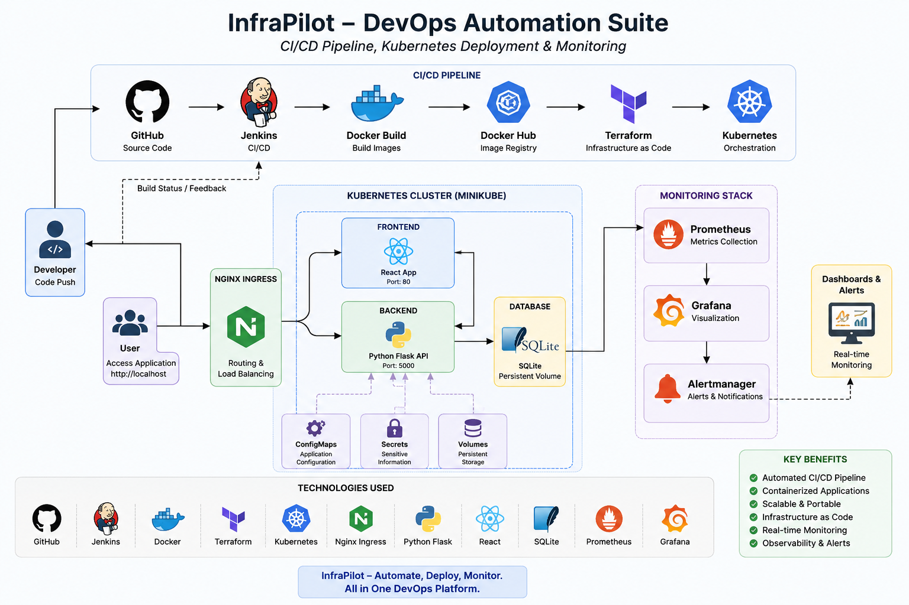
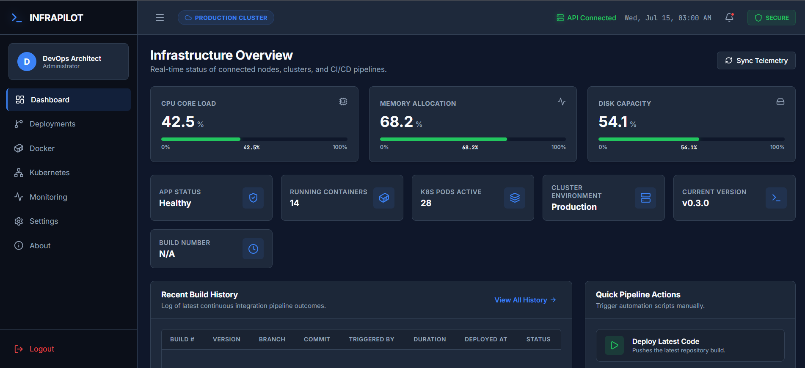
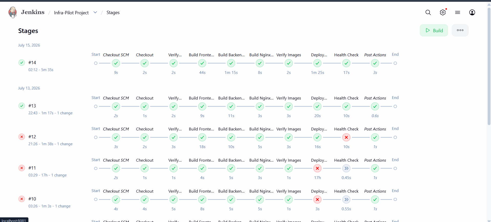
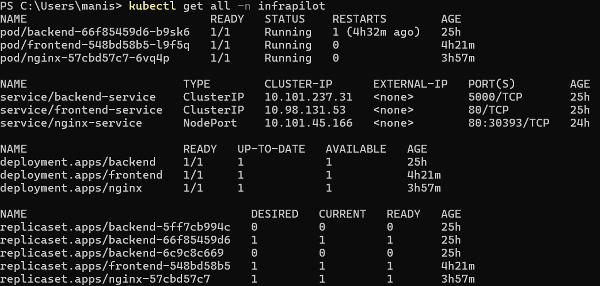
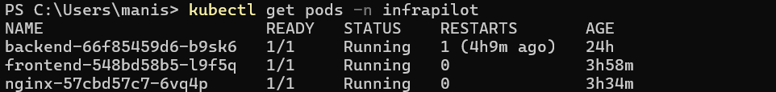
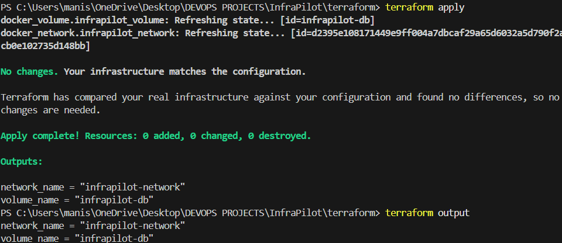
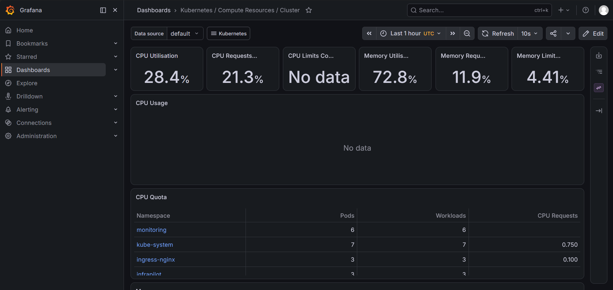

# 🚀 InfraPilot – DevOps Automation Suite

> A production-inspired DevOps automation project demonstrating CI/CD, Infrastructure as Code, Kubernetes deployment, and real-time monitoring using Prometheus and Grafana.



---

# 📖 Overview

InfraPilot is an end-to-end DevOps automation project built to showcase modern deployment practices using containerization, Infrastructure as Code, Kubernetes orchestration, and monitoring.

The project automates the complete application lifecycle—from source code management and CI/CD to Kubernetes deployment and infrastructure monitoring—providing a production-inspired workflow for deploying scalable applications.

---

# ✨ Key Features

- 🚀 Automated CI/CD pipeline with Jenkins
- 🐳 Dockerized React and Flask applications
- 🏗️ Infrastructure provisioning using Terraform
- ☸️ Kubernetes Deployments & Services
- 🌐 NGINX Ingress for application routing
- 🔐 ConfigMaps & Secrets management
- 📊 Prometheus metrics collection
- 📈 Grafana monitoring dashboards
- 💾 Persistent application storage
- 📦 Modular and production-inspired project structure

---

# 🛠️ Technology Stack

| Category | Technologies |
|-----------|--------------|
| Frontend | React.js |
| Backend | Python Flask |
| Database | SQLite |
| CI/CD | Jenkins |
| Containerization | Docker |
| Infrastructure as Code | Terraform |
| Container Orchestration | Kubernetes (Minikube) |
| Reverse Proxy | NGINX Ingress |
| Monitoring | Prometheus |
| Visualization | Grafana |
| Version Control | Git & GitHub |

---

# 🏗️ Project Architecture

The following architecture illustrates the complete DevOps workflow implemented in InfraPilot.


---

# 🔄 Deployment Workflow

```text
Developer
     │
     ▼
GitHub Repository
     │
     ▼
Jenkins CI/CD Pipeline
     │
     ▼
Docker Image Build
     │
     ▼
Terraform Infrastructure
     │
     ▼
Kubernetes Cluster
     │
     ▼
NGINX Ingress
     │
     ▼
Frontend (React)
     │
     ▼
Backend (Flask)
     │
     ▼
SQLite Database
     │
     ▼
Prometheus Monitoring
     │
     ▼
Grafana Dashboards
```

---

# 📂 Project Structure

```text
InfraPilot
│
├── app/
│   ├── frontend/
│   └── backend/
│
├── docker/
├── jenkins/
├── kubernetes/
├── terraform/
├── monitoring/
├── screenshots/
└── README.md
```

---

# 📸 Project Screenshots

## 🚀 InfraPilot Dashboard

The main application dashboard deployed on Kubernetes.



---

## ⚙️ Jenkins CI/CD Pipeline

Automated Jenkins pipeline responsible for building and deploying the application.



---

## ☸️ Kubernetes Pods

Application successfully deployed inside the Kubernetes cluster.



---

## ☸️ Kubernetes Application Pod

Running application pod inside the InfraPilot namespace.



---

## 🏗️ Terraform Infrastructure Provisioning

Infrastructure created and managed using Terraform.



---

## 📊 Grafana Monitoring Dashboard

Real-time monitoring of Kubernetes cluster resources powered by Prometheus and Grafana.



---

# 🚀 Deployment Pipeline

1. Developer pushes source code to GitHub.
2. Jenkins automatically triggers the CI/CD pipeline.
3. Docker builds application images.
4. Terraform provisions the required infrastructure.
5. Kubernetes deploys frontend and backend services.
6. NGINX Ingress routes external traffic.
7. Prometheus collects infrastructure and application metrics.
8. Grafana visualizes real-time monitoring dashboards.

---

# 📈 Monitoring

The monitoring stack includes:

- Prometheus
- Grafana
- Kubernetes Metrics
- Node Exporter
- Alertmanager

The dashboards provide visibility into:

- CPU Utilization
- Memory Usage
- Kubernetes Namespaces
- Pod Health
- Cluster Resources
- Node Metrics
- Workload Performance

---

# 🎯 Skills Demonstrated

This project demonstrates practical experience with:

- CI/CD Pipeline Design
- Docker & Containerization
- Infrastructure as Code (Terraform)
- Kubernetes Deployments
- Services & Ingress
- ConfigMaps & Secrets
- Monitoring & Observability
- Infrastructure Automation
- DevOps Best Practices

---

# 📌 Future Enhancements

- GitHub Actions Integration
- Helm-based Deployments
- Horizontal Pod Autoscaler (HPA)
- ArgoCD GitOps Workflow
- HTTPS with TLS Certificates
- Cloud Deployment (AWS / Azure)
- Multi-node Kubernetes Cluster

---

